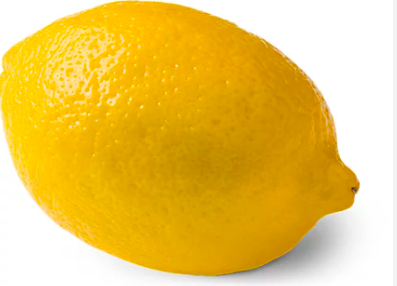
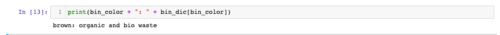
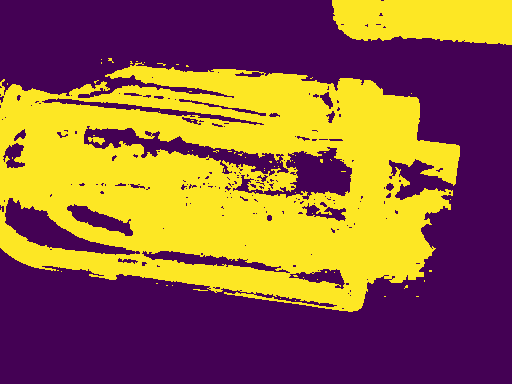
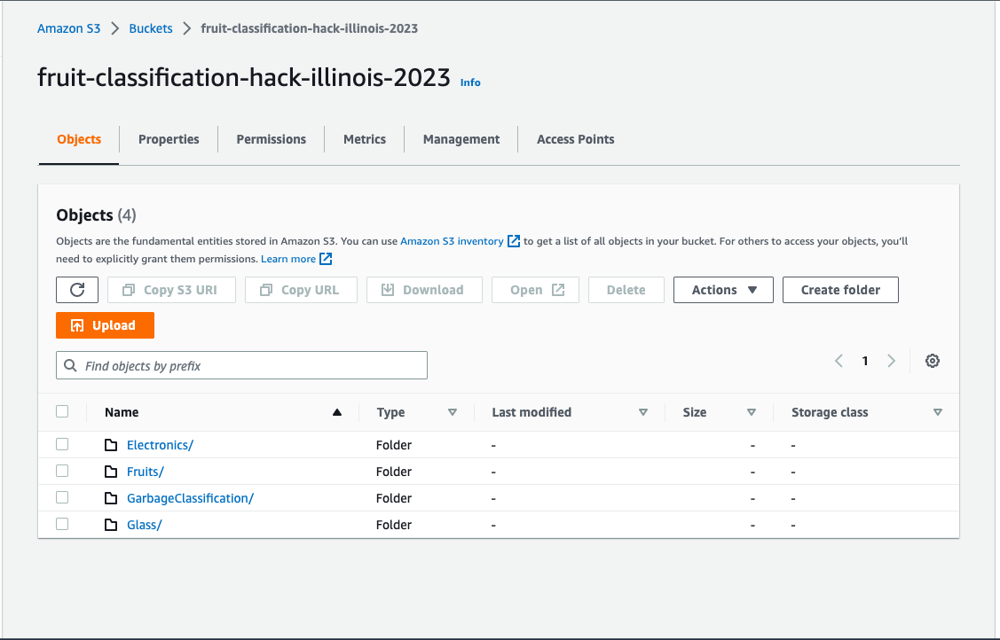

# HackIllinois2023
For HackIllinois2023, sw4th1, nzhan2, and Ameat77 created an Automated Trash Classifier.


## What is the problem?

Sources:
https://blogs.worldbank.org/sustainablecities/here-s-what-everyone-should-know-about-waste#:~:text=Poorly%20managed%20waste%20is%20contaminating,development%20such%20as%20through%20tourism

https://earth.org/waste-management-germany/

We've all been there: ambitiously sitting down to dig into PAR's stir fry but 20 minutes in realizing that there was in fact no possible way to finish every morsel of what was stacked onto our black plates. So much food waste occurs in our dining halls on campus, but when you step back and think about how much food waste occurs across the nation's schools - that's a lot. And food waste is only one type of waste. 

The world generates 2.01 billion tonnes of municipal solid waste annually, with the main waste categories being food/green, paper/cardboard, plastic, glass, and metal. Rapid urbanization, population growth, and economic development will push global waste generation to increase by 70% over the next 30 years. Thus, managing trash is critical to a sustainable future.

But how many people actually take the 5-10 minutes to research which type of waste their trash belongs into so we can manage waste better? That's where Germany, our inspiration, stepped in. In Germany, trash is strictly sorted into one of six bins: Blue (Paper and Cardboard), Yellow (Plastic and Soft Metal), Brown (Organic/Bio Waste), Black (Residual Waste), Red (Special Waste), and Glass (where glass is sorted into brown, white, or green glass). As the leading recycler of municipal waste, their comprehensive waste sorting system was something we digitally implemented so countries outside of Germany could easily follow the same model.

#tl;dr: Waste is going through the roof, so trash needs to be sorted better. How can we use computer vision and natural language processing to come up with a user interactive web app to promote easier recycling? 

## What does our project do?

In our web app, a user can upload an image of their trash. Our computer vision model, which we trained on a bunch of datasets identifies what the object is(amit add more). Then, our program maps the identified object to the specific bin classification it falls under, taking into account bin prioritization for objects falling under multiple categories (ex. red would rank higher than blue). As a fail-safe, the user can also manually type in their trash (our autospell check would ensure accuracy of input) and then it could be mapped to it's classification. Given that there are a ginormous number of words that can fall under each category, we used nltk as a part of nlp to generate a giant database of synonyms and hyponyms to accomodate a wider range of inputs. Then, our web app would display the correct bin that the user needs to drop their trash into.

## How did we do this?

### Sources

Kaggle Datasets Used:
Trash: https://www.kaggle.com/datasets/asdasdasasdas/garbage-classification

Fruit: https://www.kaggle.com/datasets/kritikseth/fruit-and-vegetable-image-recognition

Electronic: https://www.kaggle.com/datasets/dataclusterlabs/electronics-mouse-keyboard-image-dataset + my own dataset found through google images

Example Input:



Example Output (correct as fruits like lemon belong in compost):

 

### Computer Vision

We need to be able to look at a disposed item and tell which of the six categories it belongs in. We developed an Image Classification Model that can sort objects to an extent: such as whether it's a fruit or vegetable, cardboard or plastic, type of electronic, etc. Most interestingly, Germany's trash management system sorts glass into three further categories: green glass, brown glass, and clear (white) glass. So I created an Image Segmentation Model too that segments an image and uses it average RGB value to figure out it's proper color.


Image Segmentation:



### Cloud Computing

My computer didn't have enough storage for the sheer amount of training images to train the different models, so we ultilized AWS's S3 buckets to store and access our train, test, and validation data! This Cloud Computing solution ensured we could successfully train all the data we needed to given the time constraints of the Hackathon.




### Natural Language Processing

#### Main Idea:
Utilizing computer vision to analyze a user-inputted image, we generate a predicted name for the object in the image. The specific NLP task we implemented was "named entity recognition", which identifies words or phrases as useful entities. Using this predicted name, we categorized it into the different bins used in the German trash sorting system. First, we imported our necessary packages. For this part of the project, we used import csv, fileinput, autocorrect, webcolors, numpy, math, collections, and nltk. 

#### What is NLTK:
NLTK (Natural Language Toolkit) is a popular platform that works with language data. Utilizing semantic reasoning libraries, we reached a logical conclusion based on predicted name to generate synonyms and hyponyms for a pre-created set of potential trash items under each bin category. We did this in order to create a more expansive and inclusive data set that can accomodate a wider range of potential user images. 

#### Special Cases:
One of our categories was glass, and in Germany, glass is categorized into green, brown, and white. Using webcolors, we converted given glass color into its rgb int values and cross-referenced these values to approximate which out of the three glass categories it would fit best in. Given that some objects could be present under multiple bins, we created an order of priority to properly sort these objects. And some objects, like paper, is a substring of many different trash items that fit into different bins (such as wax paper, toilet paper, paper towels, etc.). To overcome this issue, we prioritized the bin in which the inputted string exactly matched the data element. Furthermore, since some trash items could be contaminated with organic materials, we created a case where any object that was contaminated would automatically be sorted into residual waste. As a fail-safe in case the computer vision couldn't identify the object, we also created a functionality for the user to type their object. To account for misspellings, we also created an autocorrect function to correct user input. 

### Front-End Development (React.js, 3D-Modeling, and Flask)

For our front-end, we created an interative web-app where users can enter pictures of their trash or a description of their trash, and the output will be the respective bin it belongs too. While our backend code currently isn't linked to this front-end, we plan to learn Flask and implement it to accomplish this task.


## How to recreate our project!

```
git clone https://github.com/Ameat77/HackIllinois2023.git
```
```
pip install -r requirements.txt
```
Follow the commands in npmrequirements.txt to install npm and its respective dependencies.
```
npm start
```
